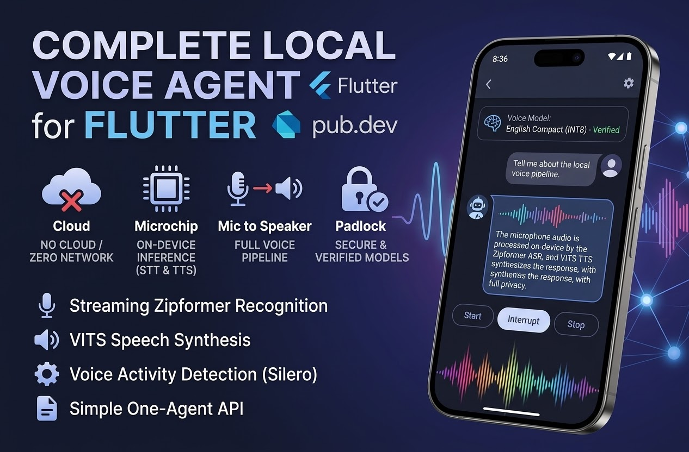

[](https://pub.dev/packages/flutter_local_voice_agent)
[](https://pub.dev/packages/flutter_local_voice_agent/score)
[](https://github.com/ortal83cohen/flutter_local_voice_agent/actions/workflows/checks.yml)
[](LICENSE)

# Offline speech-to-text and text-to-speech

A complete on-device voice pipeline for Flutter. Speech-to-text (STT) and
text-to-speech (TTS) are already wired together — microphone, voice activity
detection, recognition, your reply, synthesis, and playback — so you do not
assemble those pieces yourself.

Audio stays native. Models stay local. There is no cloud STT or TTS service
to configure.



**Development preview.** Physical Android/iPhone qualification, voice quality,
resource budgets, and binary/model redistribution review remain open. The VITS
backend generates complete sentences before its PCM callback; the render queue
is bounded, but upstream synthesis allocation is not yet proven to satisfy the
hard duration/memory budget. Do not treat this preview as a production-qualified
SDK.

## Features

- **Speech-to-text (STT / ASR):** streaming Zipformer recognition with revisable
  partial transcripts and a finalized result per turn
- **Text-to-speech (TTS):** VITS speech synthesis and native playback from a
  local reply
- **Voice activity detection (VAD):** Silero, 512-sample windows at 16 kHz
- **One agent API:** `create`, `start`, `interrupt`, `stop`, `dispose`
- **Offline inference:** creation and recognition stay on-device; audio never
  travels through Dart platform messages
- **Explicit model preparation:** download a trusted pack over HTTPS, verify
  hashes, cancel or retry, then reuse it offline
- **Typed events:** lifecycle, activity, transcript, reply, and failure
- **Optional local LLM:** a separate CPU GGUF path; the default is a Dart
  reply function

## Platform support

| Platform | Status |
|---|---|
| Android | API 26+, arm64-v8a |
| iOS | CocoaPods + AVAudioEngine; add `NSMicrophoneUsageDescription` |
| Web | Unsupported |
| macOS, Windows, Linux | Unsupported |
| Background / wake word | Unsupported |
| Full duplex / barge-in | Unsupported |

Requires Flutter 3.47.0 / Dart 3.13.0. Build verification and physical
qualification are separate; see [capabilities](doc/capabilities.md).

## Use

```dart
import 'package:flutter_local_voice_agent/flutter_local_voice_agent.dart';

final agent = await LocalVoiceAgent.create(
  models: LocalModelBundle(
    directory: '/app-private/models/english',
    manifestPath: '/app-private/models/english/manifest.json',
  ),
  logic: (transcript) async => 'Hello. How are you?',
);
final subscription = agent.events.listen((event) {
  // Display typed state, transcript, reply, or failure events.
});
await agent.start();
// At a user interruption:
await agent.interrupt();
// Before leaving the foreground conversation:
await agent.stop();
await subscription.cancel();
await agent.dispose();
```

Manifest validation and model loading precede microphone activation. Start
asks for microphone permission. A missing or corrupt asset, or a refused
permission, is an explicit `AgentFailure`. There is no cloud fallback.
Android declares `RECORD_AUDIO` through the plugin and requests it from the
foreground Activity.

Logic replies must be nonempty, contain valid Unicode scalars without NUL, and
fit within 240 scalars and 960 UTF-8 bytes. Invalid replies emit a typed fault
and interrupt the turn before native synthesis; the next turn can proceed.
These input checks do not remove the upstream VITS allocation limitation.

The host supplies trusted local assets and must not mutate them while a
session is alive. `FileModelStore.install` copies into staging, validates
again, and renames to a fresh directory; it does not remove older active
packs. An integrity manifest is not an authenticity signature. Do not load
untrusted ONNX/GGUF files.

Use one agent per Flutter engine. Stop on backgrounding. OS focus loss,
interruption, route removal, or severe thermal pressure suspends operation;
resuming requires an explicit Start. Recreate the agent when iOS reports a
changed input format. Audio-session ownership must be coordinated with any
other audio plugins in the host app.

## Models

No model weights ship in the package. `VoiceModelCatalog.entries` lists two
pinned English speech packs (compact INT8 and full precision) with hashes and
source notices. `ModelPreparationManager` prepares a host-supplied trusted
descriptor into a host-chosen private directory, with integrity checks,
cancellation, and verified offline reuse. It returns a `LocalModelBundle` for
`LocalVoiceAgent.create`.

See the [preparation guide](doc/model-preparation.md) and the
[model catalog](doc/model-catalog.md). Advanced hosts can still construct
[local packs](doc/models.md).

The example downloads a selected verified pack on first use, then restores it
offline. The packs use the same English voice at different precision levels.
No Hebrew, other-language, physical-device performance, or voice-quality
guarantee is implied.

## Setup

This preview currently requires a repository checkout and a local Flutter path
dependency pointing to that checkout. The pub archive excludes native runtime
binaries and provisioning tools; a zero-warning package dry run does not
establish a standalone consumer install. Native dependency packaging remains
unfinished.

From the repository root:

```sh
python3 tool/provision_runtime.py android
python3 tool/provision_runtime.py ios
flutter pub get
```

These commands download SHA-256 pinned sherpa-onnx 1.12.14 build artifacts.
For a network-free build input step, pass `--archive /path/to/the/archive`.
They are never invoked by the running application.

## Example

```sh
cd example
flutter run
```

Choose **English compact (INT8)** or **English standard (full precision)**,
review the download size, then tap **Download**. Preparation reports progress
and can be cancelled or retried. After the engine is ready, tap **Start**,
allow the microphone, and try “hello”, “what is your name”, or “thank you”.
These are fixed local demo replies, not a general-purpose LLM conversation.
Interrupt and Stop are explicit controls. Later launches restore the selected
installed pack without networking.

```sh
flutter test
dart format lib example/lib
dart analyze --fatal-infos --fatal-warnings
python3 tool/lint_wiki.py
```

## Learn more

- [Capabilities and limits](doc/capabilities.md)
- [Model catalog, storage, and troubleshooting](doc/model-catalog.md)
- [Explicit model preparation](doc/model-preparation.md)
- [Optional local LLM](doc/llm.md)
- [Native testing](doc/testing.md)
- [Third-party notices](third_party/README.md)
- [Issue tracker](https://github.com/ortal83cohen/flutter_local_voice_agent/issues)

Scheduler test fixtures are not substitutes for real engines. No publish,
commit, push, or deployment step is part of these instructions.
